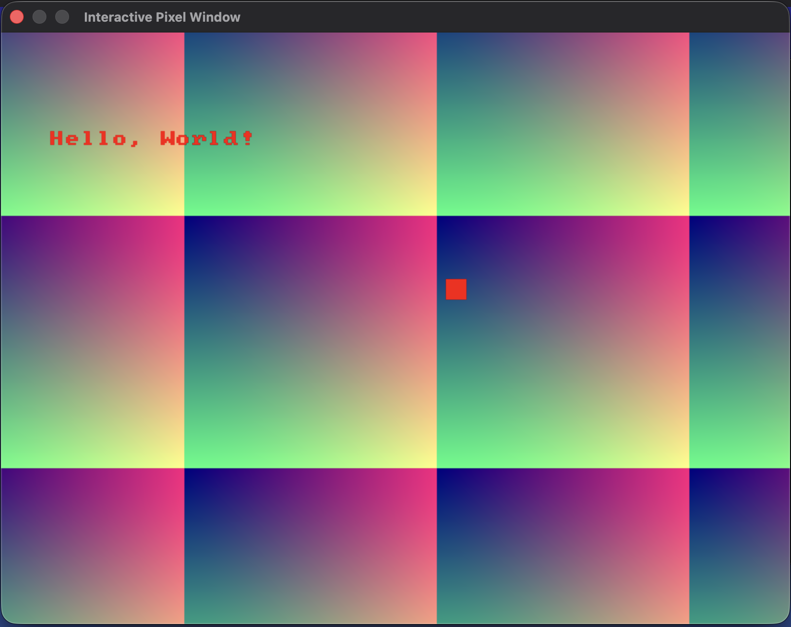
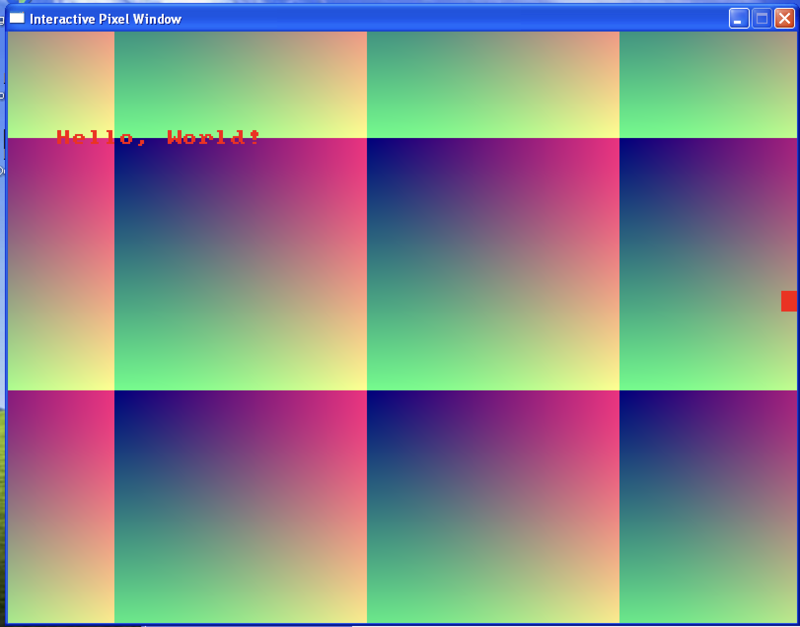

# Pixel Window

A minimal, header only, cross platform window-spawning library. 
Provides a buffer of RGB pixels, mouse, and realtime keyboard, and Sprite Text on Mac OS, 
Linux X11/Wayland, and Windows (Win32). All CPU rendered.

## Examples
You include `pixel_window.h` and you are good to go! See CMakeLists.txt for any linking considerations

The core premise:
```
    // ...
    PixelWindow* win = pw_create_window(width, height, "Interactive Pixel Window", false);
    
    // ...
    while (something) {
        // ...
        pw_update_window(win, rgb_buffer);
        // ...
    }
```
see main.cpp for an example.




## Building Example Program
```
cmake -B build .
cd build
make
```
